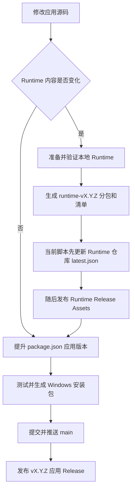

# YOLO26ModelTraining 发布与 Runtime 维护完整教程

本文是 `YOLO26ModelTraining` 应用仓库和 `YOLO26ModelTraining-Runtime` 运行时仓库的发布操作手册，也是后续 AI 接手项目时的主要上下文来源。

文档创建时的已发布版本：

- 应用：`v0.3.5`
- Runtime：`runtime-v1.0.0`
- 应用仓库：<https://github.com/GXICll-Dev/YOLO26ModelTraining>
- Runtime 仓库：<https://github.com/GXICll-Dev/YOLO26ModelTraining-Runtime>

版本号会继续变化。执行发布时必须以 `package.json`、`runtime/latest.json` 和 GitHub Release 的实时状态为准，不能直接照抄上面的版本号。

## 1. 两个仓库分别负责什么

### 1.1 应用源码仓库

`GXICll-Dev/YOLO26ModelTraining` 保存：

- Electron 主进程和更新管理器；
- Go 后端；
- TypeScript/Vite 前端；
- Windows 安装包构建脚本；
- Runtime 生成、校验和发布脚本；
- 软件 Release Notes。

普通软件更新生成约 143 MiB 的 Windows 安装包，不重复携带约 4.6 GiB 的 Python/PyTorch/CUDA Runtime。

### 1.2 Runtime 仓库

`GXICll-Dev/YOLO26ModelTraining-Runtime` 只是公开下载源，保存：

- `runtime/latest.json`：客户端启动时读取的最新 Runtime 清单；
- Runtime 使用说明；
- GitHub Release 中的分包 ZIP 和 `runtime-release.json`。

Runtime ZIP 不提交进 Git。它们只作为 GitHub Release Assets 上传。

### 1.3 用户电脑上的目录

应用由 Squirrel 安装到：

```text
%LOCALAPPDATA%\YOLO26ModelTraining
```

Windows 会在当前用户的“设置 → 应用 → 已安装的应用”中注册标准卸载项。安装、更新或正常启动时还会把真实的 `Uninstall.exe` 部署到 `%LOCALAPPDATA%\YOLO26ModelTraining\Uninstall.exe`；双击后由它调用同目录的 `Update.exe --uninstall` 执行 Squirrel 官方卸载流程。

所有由程序管理的内容统一位于同一个应用根目录：

```text
%LOCALAPPDATA%\YOLO26ModelTraining\app-<version>
%LOCALAPPDATA%\YOLO26ModelTraining\runtime\windows-x64-cuda126-py311
%LOCALAPPDATA%\YOLO26ModelTraining\downloads\runtime
%LOCALAPPDATA%\YOLO26ModelTraining\updates
%LOCALAPPDATA%\YOLO26ModelTraining\user-data
```

其中 `downloads\runtime` 只在下载或未完成部署时存在；Runtime 完成解压、验证和原子切换后会立即删除全部分包和该下载目录。`v0.3.5` 启动时会把旧版 `%LOCALAPPDATA%\YOLO26ModelTrainingData` 以及旧 Electron 用户数据迁移到新目录。

卸载会删除整个 `%LOCALAPPDATA%\YOLO26ModelTraining`，并额外清理仍然存在的旧版目录，因此主程序、Runtime、缓存、更新安装包、日志和内部状态不会保留。用户自行选择的训练项目、图片和训练输出不属于程序安装目录，不能在卸载时删除。

## 2. 整体更新流程



判断原则：

- 只修改界面、Electron、Go、日志、业务逻辑或安装器：只发布应用版本。
- 修改 Python、PyTorch、CUDA、Torchvision、Ultralytics、OpenCV、LabelMe、模型或 Runtime 必需文件：发布新的 Runtime 版本；如果应用代码也有变化，再发布新的应用版本。
- 只修改文档：只提交并推送 Git，不创建软件 Release。

## 3. 发布前准备

### 3.1 推荐的本地目录结构

两个仓库默认放在同一个父目录下：

```text
ModelTrainingDist_encrypted/
  modeltraining-go-ts/
  YOLO26ModelTraining-Runtime/
```

`publish-runtime-release.ps1` 默认按这个兄弟目录结构寻找 Runtime 仓库。如果目录不同，发布时必须传入 `-RuntimeRepoDir`。

### 3.2 必需工具

- Windows 10/11 x64；
- PowerShell；
- Git；
- Go；
- Node.js 和 npm；
- GitHub CLI `gh`；
- 可访问 GitHub 和 GitHub Release Assets 的网络。

首次配置示例：

```powershell
winget install --id GitHub.cli
gh auth login
gh auth status

git config user.name "Wanglin"
git config user.email "devvanglin@gmail.com"
```

安装依赖：

```powershell
cd D:\Coding\v8源码\ModelTrainingDist_encrypted\modeltraining-go-ts
npm ci
npm --prefix web ci
```

Runtime 生成需要较多空间。建议开发机至少预留 15 GiB 可用空间；用户首次部署时程序会按下载大小、安装大小和临时空间自动计算，当前界面提示至少约 10 GiB。

### 3.3 每次发布前先同步并检查

```powershell
$appRepo = "D:\Coding\v8源码\ModelTrainingDist_encrypted\modeltraining-go-ts"
$runtimeRepo = "D:\Coding\v8源码\ModelTrainingDist_encrypted\YOLO26ModelTraining-Runtime"

git -C $appRepo status --short
git -C $runtimeRepo status --short
git -C $appRepo pull --ff-only
git -C $runtimeRepo pull --ff-only
gh auth status
```

不要覆盖不属于当前任务的未提交修改。发现脏工作区时，先确认修改来源和归属。

## 4. 发布普通应用更新

下面用下一个示例版本 `0.3.2` 演示。实际发布时选择一个尚未存在的新版本。

### 4.1 确认远程版本没有被占用

```powershell
$appVersion = "0.3.2"
$appTag = "v$appVersion"
gh release view $appTag --repo GXICll-Dev/YOLO26ModelTraining
```

如果命令显示 Release 已存在，不要覆盖一个已经提供给用户的正式版本。应继续增加补丁版本，例如从 `0.3.2` 改为 `0.3.3`。

### 4.2 修改版本号

应用版本至少要同步修改：

- `package.json` 顶层 `version`；
- `package-lock.json` 顶层和根包的 `version`；
- `web/src/App.tsx` 中浏览器模式使用的默认 `currentVersion`、`latestVersion` 和 `appVersion`。

可以先用 npm 更新两个 package 文件：

```powershell
npm version $appVersion --no-git-tag-version
```

然后手动把 `web/src/App.tsx` 的默认版本同步为相同值。Electron 正式运行时会从 `app.getVersion()` 获取真实版本，但浏览器模式默认值仍应保持一致。

检查是否遗漏旧版本：

```powershell
rg -n '"version"|currentVersion|latestVersion|useState\("[0-9]' package.json package-lock.json web/src/App.tsx
```

语义化版本规则：

- 修复或小界面调整：增加补丁号，例如 `0.3.1 -> 0.3.2`；
- 向后兼容的新功能：增加次版本号，例如 `0.3.2 -> 0.4.0`；
- 存在破坏性变化：增加主版本号。

### 4.3 编写更新说明

编辑根目录 `RELEASE_NOTES.md`：

```markdown
# v0.3.2

一句话说明本次更新。

- 用户能感知的变化 1。
- 用户能感知的变化 2。
- 修复的问题。
```

更新弹窗会直接显示 GitHub Release 的正文，因此不要写内部密钥、私人路径、用户数据或无关调试信息。

更新内容使用 `react-markdown` 和 `remark-gfm` 按 GitHub 风格 Markdown 渲染，支持标题、列表、任务列表、表格、链接、图片、引用和代码块。原始 HTML 默认不解析，发布说明不能依赖嵌入式 HTML 标签。

### 4.4 执行测试

```powershell
npm run test:electron
npm audit --omit=dev
go test ./...
go vet ./...
go build ./...
npm run build:web
git diff --check
```

发布前最低通过标准：

- Electron 测试全部通过；
- Go test/vet/build 全部通过；
- TypeScript 和 Vite 构建通过；
- `npm audit --omit=dev` 没有生产依赖漏洞；
- `git diff --check` 没有空白错误。

### 4.5 生成 Windows 安装包

```powershell
npm run electron:installer
```

这个命令会：

1. 构建 Web 前端；
2. 构建 Windows x64 Go 后端；
3. 设置 `MT_CORE_ONLY=1`，确保安装器不包含大体积 Runtime；
4. 在纯 ASCII 临时目录中运行 Electron Forge/Squirrel，避免中文路径导致 `rcedit` 失败；
5. 调用 `verify-core-package.ps1` 校验封装内容；
6. 生成安装包和 SHA-256 文件。

输出：

```text
out/installer/win32/x64/YOLO26ModelTraining-Setup-<version>.exe
out/installer/win32/x64/YOLO26ModelTraining-Setup-<version>.exe.sha256
```

本地复核：

```powershell
$installer = "out\installer\win32\x64\YOLO26ModelTraining-Setup-$appVersion.exe"
$actualHash = (Get-FileHash -Algorithm SHA256 -LiteralPath $installer).Hash.ToLowerInvariant()
$expectedHash = ((Get-Content -LiteralPath "$installer.sha256" -Raw) -split '\s+')[0].ToLowerInvariant()
$actualHash
$actualHash -eq $expectedHash
```

`npm run package:verify` 主要用于包含完整 Runtime 的便携目录 `out/YOLO26ModelTraining-win32-x64`。安装器构建本身已经在临时目录执行 `verify-core-package.ps1`，不要把旧便携目录的验证结果误当成新安装器验证结果。

### 4.6 提交修改

```powershell
git status --short
git diff --check
git add package.json package-lock.json web/src/App.tsx RELEASE_NOTES.md
git add <本次其他实际修改文件>
git commit -m "release: publish v$appVersion"
git status --short
```

提交后工作区必须干净。`publish-app-release.ps1` 会拒绝发布存在未提交修改的仓库。

### 4.7 推送并创建 GitHub Release

如果安装包已经成功生成，避免重复构建：

```powershell
npm run release:app -- -SkipBuild
```

如果还没有构建安装包：

```powershell
npm run release:app
```

脚本会：

1. 检查 GitHub CLI 登录状态；
2. 根据 `package.json` 读取版本；
3. 必要时构建安装包；
4. 要求 Git 工作区干净；
5. 推送 `main`；
6. 创建或更新 `v<version>` GitHub Release；
7. 上传安装包和 `.sha256` 文件。

脚本通过 GitHub Release 创建远程标签，不会主动创建本地标签。需要本地标签时执行：

```powershell
git fetch --tags
```

正式 Release 必须满足：

- 标签格式为 `vX.Y.Z`；
- 不是 Draft；
- 不是 Prerelease；
- 安装包名称严格为 `YOLO26ModelTraining-Setup-X.Y.Z.exe`；
- 同时存在 `.exe.sha256`，或者 GitHub API 为资产提供 `sha256:` digest。

更新管理器读取：

```text
https://api.github.com/repos/GXICll-Dev/YOLO26ModelTraining/releases/latest
```

它只在远程版本高于当前版本时提示更新。

### 4.8 发布后在线核验

```powershell
$release = Invoke-RestMethod `
  -Headers @{ "User-Agent" = "YOLO26-Release-Verification" } `
  -Uri "https://api.github.com/repos/GXICll-Dev/YOLO26ModelTraining/releases/tags/$appTag"

$asset = $release.assets | Where-Object name -eq "YOLO26ModelTraining-Setup-$appVersion.exe"
$localInstaller = "out\installer\win32\x64\YOLO26ModelTraining-Setup-$appVersion.exe"
$localHash = (Get-FileHash -Algorithm SHA256 -LiteralPath $localInstaller).Hash.ToLowerInvariant()
$remoteHash = ([string]$asset.digest).Replace("sha256:", "").ToLowerInvariant()

$release.draft
$release.prerelease
$asset.size -eq (Get-Item -LiteralPath $localInstaller).Length
$remoteHash -eq $localHash
```

模拟旧版本和当前版本的真实在线更新检查：

```powershell
@'
const { UpdateManager } = require('./electron/update-manager.cjs');

async function check(version) {
  const manager = new UpdateManager({
    currentVersion: version,
    fetch: global.fetch,
    userDataRoot: process.env.TEMP,
    quitAndInstall() {}
  });
  const state = await manager.check();
  console.log({
    currentVersion: version,
    latestVersion: state.latestVersion,
    updateAvailable: state.updateAvailable,
    phase: state.phase,
    error: state.error
  });
}

(async () => {
  await check('替换为上一个版本');
  await check('替换为刚发布的版本');
})();
'@ | node -
```

预期：上一个版本返回 `updateAvailable: true`，刚发布的版本返回 `false`。

## 5. 发布新的 Runtime

### 5.1 什么时候必须提升 Runtime 版本

以下任意内容发生变化时，创建新的 Runtime 版本：

- CPython；
- PyTorch、Torchvision、CUDA 构建；
- Ultralytics 或其他 Python 依赖；
- OpenCV；
- YOLO 默认模型；
- LabelMe；
- app-local VC++ DLL；
- `runtime-manifest.json` 中影响运行的文件；
- Runtime 的目录契约或 `runtimeId`。

只修改前端、Go、Electron 或文档时，不要重新发布 Runtime。

### 5.2 Runtime 版本不可覆盖原则

公开后的 Runtime Release Assets 必须视为不可变文件。

客户端会依赖 `runtime/latest.json` 中记录的：

- 固定版本下载 URL；
- 文件大小；
- SHA-256。

如果已经公开的 ZIP 内容有任何变化，必须创建新的 Runtime 版本，例如 `1.0.0 -> 1.0.1`。不能替换 `runtime-v1.0.0` 下的 ZIP 后继续沿用旧清单。

只有发布过程中断、版本尚未正式提供给用户时，才可以用同版本修复未完成的上传。修复完成后仍要重新核对全部资产。

### 5.3 准备本地 Runtime

常规准备和验证：

```powershell
npm run runtime:prepare
npm run runtime:verify
```

锁文件、依赖或 Runtime 内容明确变化时强制重建：

```powershell
npm run runtime:rebuild
npm run runtime:verify
```

主要来源和输出：

```text
scripts/runtime-win-x64-cuda.lock.json
runtime/python/python.exe
runtime/models/yolo26n.pt
runtime/runtime-manifest.json
tools/labelme/labelme.exe
```

`runtime/`、`tools/labelme/`、缓存、模型和生成 ZIP 都被 `.gitignore` 排除，不能误提交到应用源码仓库。

### 5.4 生成 Runtime 分包

下面以 `1.0.1` 为例：

```powershell
$runtimeVersion = "1.0.1"
npm run runtime:release -- -RuntimeVersion $runtimeVersion
```

输出目录：

```text
artifacts/runtime-release/runtime-v1.0.1/
```

包含：

- `runtime-python-base-v1.0.1.zip`；
- 一个或多个 `runtime-torch-XX-v1.0.1.zip`；
- `runtime-tools-v1.0.1.zip`；
- `runtime-models-v1.0.1.zip`；
- `runtime-release.json`；
- `latest.json`。

当前默认 `MaxPackageBytes` 为 `1400MB`。具体 Torch 分包数量取决于文件大小，不能假设永远是 4 个 Torch ZIP 或总共 7 个 ZIP。应始终以新清单的 `packages` 数组为准。

生成脚本会先运行本地 Runtime 验证，然后计算每个 ZIP 的大小和 SHA-256，并为关键文件记录大小和 SHA-256。

### 5.5 完整解压验证分包

```powershell
npm run runtime:release:verify -- "artifacts/runtime-release/runtime-v$runtimeVersion/runtime-release.json"
```

验证器会：

1. 校验每个 ZIP 的实际大小；
2. 校验每个 ZIP 的 SHA-256；
3. 把所有 ZIP 解压到临时目录；
4. 校验关键文件的大小和 SHA-256；
5. 启动内置 Python；
6. 导入 PyTorch、Torchvision、OpenCV 和 Ultralytics；
7. 加载 YOLO 模型；
8. 执行 CUDA 张量测试；
9. 验证 CPU 回退。

不能只看 ZIP 已生成就直接发布。

### 5.6 发布 Runtime

默认两个仓库位于兄弟目录时：

```powershell
npm run release:runtime -- -RuntimeVersion $runtimeVersion
```

已经完成生成和完整验证时：

```powershell
npm run release:runtime -- -RuntimeVersion $runtimeVersion -SkipBuild
```

Runtime 仓库不在默认位置时：

```powershell
npm run release:runtime -- `
  -RuntimeVersion $runtimeVersion `
  -RuntimeRepoDir "D:\path\to\YOLO26ModelTraining-Runtime"
```

脚本会：

1. 生成并验证 Runtime（未指定 `-SkipBuild` 时）；
2. 把生成的 `latest.json` 复制到 Runtime 仓库的 `runtime/latest.json`；
3. 在 Runtime 仓库提交并推送清单；
4. 创建 `runtime-v<version>` GitHub Release；
5. 逐个上传 ZIP 和 `runtime-release.json`；
6. 每个资产失败时最多重试 4 次。

注意：当前一键脚本会先推送 `runtime/latest.json`，再上传 Release Assets。因此执行过程中不要关闭终端或中断网络。如果上传中断，应立即用相同版本和 `-SkipBuild` 重试，确认所有资产完成后再对外宣布。长期更稳妥的改进方向是先上传完整的 Draft Release，再最后更新 `runtime/latest.json`。

### 5.7 Runtime 发布后核验

读取远程清单：

```powershell
$manifestUrl = "https://raw.githubusercontent.com/GXICll-Dev/YOLO26ModelTraining-Runtime/main/runtime/latest.json"
$manifest = Invoke-RestMethod -Headers @{ "Cache-Control" = "no-cache" } -Uri $manifestUrl
$manifest.runtimeVersion
$manifest.packages | Select-Object fileName, size, sha256, url
```

查看 GitHub Release：

```powershell
$runtimeTag = "runtime-v$runtimeVersion"
gh release view $runtimeTag `
  --repo GXICll-Dev/YOLO26ModelTraining-Runtime `
  --json tagName,isDraft,isPrerelease,url,assets
```

必须逐项确认：

- 远程 `runtime/latest.json` 与本地生成的 `latest.json` 语义一致；
- 清单 `packages` 数量等于 Release 中 ZIP 数量；
- 每个 `fileName` 都存在；
- 每个大小一致；
- 每个 SHA-256 一致；
- 每个下载 URL 跟随重定向后返回 HTTP 200；
- `runtime-release.json` 已上传；
- Runtime Release 不是 Draft 或 Prerelease。

下载入口检查：

```powershell
foreach ($package in $manifest.packages) {
  $status = curl.exe -L -I -sS --max-time 30 -o NUL -w "%{http_code}" $package.url
  "$($package.fileName): $status"
}
```

最后使用正式应用执行一次“重新检测”或在干净测试目录模拟 Runtime 安装。客户端应完成分包下载、SHA-256 校验、解压、冒烟测试和原子切换。

## 6. 客户端实际工作机制

### 6.1 软件更新

`electron/update-manager.cjs`：

- 每次启动读取应用仓库最新 GitHub Release；
- 使用语义化版本比较；
- 查找 `YOLO26ModelTraining-Setup-*.exe`；
- 支持 HTTP Range 断点续传；
- 下载到 `%LOCALAPPDATA%\YOLO26ModelTraining\updates`；
- 优先使用 GitHub Asset digest，否则读取 `.sha256` 文件；
- SHA-256 通过后启动可见的 Squirrel 安装器；确认安装器进程成功启动后退出旧应用，安装完成后由 Squirrel 自动打开新版本。

### 6.2 Runtime 更新

`electron/runtime-manager.cjs`：

- 读取 Runtime 仓库 `runtime/latest.json`；
- 校验 `runtimeId`、文件名、URL、大小和 SHA-256 格式；
- 检查磁盘空间；
- 下载 `.part` 文件并使用 HTTP Range 续传；
- 每包下载完成后验证 SHA-256；
- 解压到 `.staging-<runtimeId>-<timestamp>`；
- 校验关键文件并运行 Python/PyTorch/YOLO 冒烟测试；
- 写入 `installed-runtime.json`；
- 先备份旧 Runtime，再原子切换新目录；
- 部署成功后删除全部 Runtime ZIP 分包和 `downloads\runtime`；
- 失败时清理 staging 并继续保留旧 Runtime。

环境变量覆盖入口仅用于开发或测试：

```text
MT_UPDATE_RELEASE_API
MT_RUNTIME_MANIFEST_URL
```

正式发布不要让这些变量指向私人地址或临时文件。

## 7. 常见故障

### GitHub CLI 未安装或未登录

```powershell
winget install --id GitHub.cli
gh auth login
gh auth status
```

脚本也会尝试 `C:\Program Files\GitHub CLI\gh.exe`。

### 发布脚本提示工作区不干净

```powershell
git status --short
git diff
```

确认修改后提交。不要为了通过检查而丢弃用户的未提交内容。

### 提示缺少安装包或 SHA-256

```powershell
npm run electron:installer
Get-ChildItem out\installer\win32\x64
```

确认文件版本与 `package.json` 完全一致。

### 旧版本没有检测到新版本

检查：

- Release 是否为最新正式 Release；
- 标签是否为严格的 `vX.Y.Z`；
- 新版本是否确实高于客户端版本；
- 是否存在符合命名规则的安装包；
- GitHub API 是否可访问；
- Release 是否误设为 Draft/Prerelease。

### Runtime 下载 404

检查清单中的 tag、文件名和 GitHub Release Asset 是否逐字一致。不要只检查 Release 页面是否存在。

### Runtime SHA-256 不一致

不要降低或跳过校验。检查是否上传了错误文件、清单是否来自另一轮构建、同版本资产是否被覆盖。公开版本出现问题时创建新的 Runtime 版本。

### Runtime 部署失败

查看应用详细日志中的原生 Python stdout、stderr 和完整 Traceback。旧 Runtime 会保留；修复后可以重新点击下载，未完成的 `.part` 文件支持续传。

### Windows 显示“未知发布者”

当前安装包未做商业代码签名，Windows 可能显示 Unknown publisher 或 SmartScreen 提示。要消除此提示需要购买代码签名证书，并在发布脚本中增加签名和签名验证步骤。

### 更新完成后没有自动重新打开

检查 `electron/update-manager.cjs` 启动安装包时是否错误地传入了 `--silent`。Squirrel 的静默安装会完成文件替换，但不会自动启动新应用；正常的“重启并安装”流程必须使用无 `--silent` 参数的安装器，并在确认安装器成功启动后再退出旧应用。

## 8. 回滚和修复原则

### 应用 Release 出错

不要要求客户端降级，也不要静默替换已经公开的安装包。修复代码后提升补丁版本并发布新的正式 Release。

### Runtime Release 出错

保留旧 Release，修复 Runtime 后发布新的 `runtime-vX.Y.Z`，再把 Runtime 仓库的 `runtime/latest.json` 指向新版本。客户端的 staging 和原子切换机制会避免破坏已经可用的旧 Runtime。

### 发布过程被中断

- 应用：确认 GitHub Release 和两个资产是否完整；未公开使用时可重新运行相同命令，公开后优先提升补丁版本。
- Runtime：立即检查每个清单资产；未完成时用相同版本和 `-SkipBuild` 补齐，全部核验前不要通知用户更新。

## 9. AI 接手时的强制检查清单

任何 AI 或维护者执行发布前都必须：

1. 阅读本文件和两个仓库 README；
2. 检查两个仓库 `git status --short`；
3. 从实时文件读取版本，不能凭聊天记录猜测；
4. 判断本次是否真的需要 Runtime Release；
5. 不提交 `.venv`、`runtime/`、模型、训练数据、日志、缓存、ZIP 或密钥；
6. 不覆盖公开的 Runtime Assets；
7. 应用发布前运行测试并核对安装包 SHA-256；
8. Runtime 发布前完成“生成、解压、关键文件哈希、Python、CUDA、CPU、模型加载”验证；
9. 发布后重新查询 GitHub，而不是只相信上传命令返回成功；
10. 最后再次确认本地 `HEAD`、`origin/main`、远程 tag 和工作区状态。

## 10. 关键文件索引

| 文件 | 作用 |
| --- | --- |
| `package.json` | 应用版本和 npm 发布命令 |
| `package-lock.json` | 锁定 Node 依赖并同步应用版本 |
| `RELEASE_NOTES.md` | 应用 GitHub Release 正文 |
| `forge.config.cjs` | Electron 打包资源和 core-only 规则 |
| `scripts/make-installer-win-x64.ps1` | 生成小体积 Windows 安装包和 SHA-256 |
| `scripts/publish-app-release.ps1` | 推送应用 main、创建 Release、上传安装包 |
| `scripts/prepare-portable-runtime.ps1` | 准备本地完整 Runtime |
| `scripts/verify-portable-runtime.ps1` | 验证本地 Runtime |
| `scripts/build-runtime-release.ps1` | 拆分 Runtime ZIP 并生成清单 |
| `electron/verify-runtime-release.cjs` | 解压并验证全部 Runtime 分包 |
| `scripts/publish-runtime-release.ps1` | 推送 Runtime 清单并上传 Release Assets |
| `electron/update-manager.cjs` | 客户端应用更新检查、下载、校验和安装 |
| `electron/runtime-manager.cjs` | Runtime 检测、下载、校验、部署和原子切换 |
| Runtime 仓库 `runtime/latest.json` | 客户端读取的在线 Runtime 入口 |
